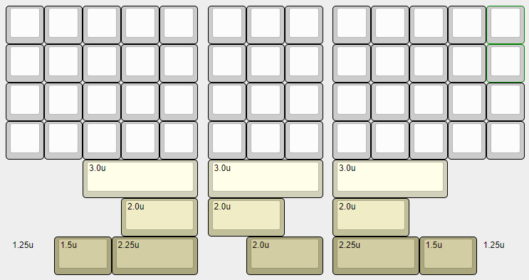

Ortholinear PCB for bully keyboard
------------------------------

This is a "split" Ortholinear pcb made for [Bully keyboard](https://mkh.works/#bully).

### Features
- 5 columns on each side, with a 3 column center cluster
- RP2040

### Supported layouts

### Production files
JLCPCB [production files](pcb/production) are provided. Components placement should be correct, but as always, do your own diligence when odering.

